# Beautiful Material UI Dashboard
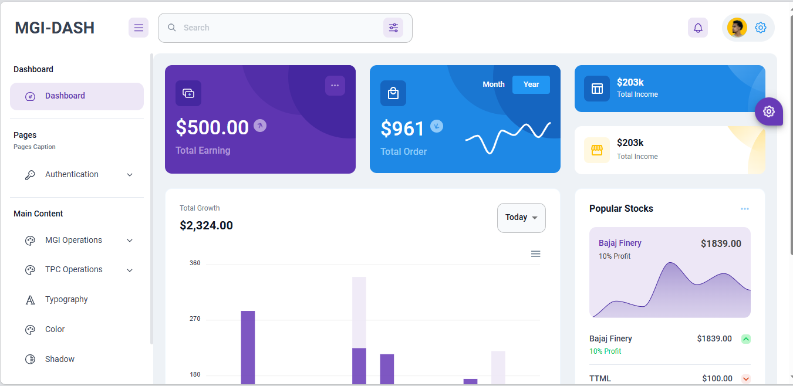

# Login Page
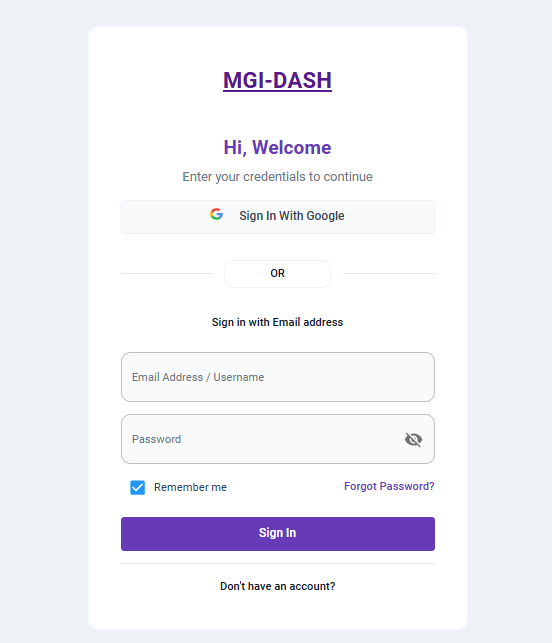

# SignUp Page
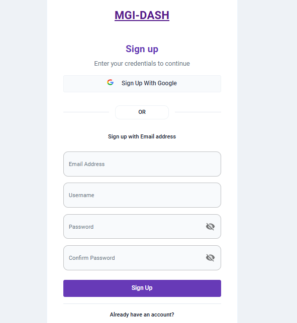

# Currencies Pages
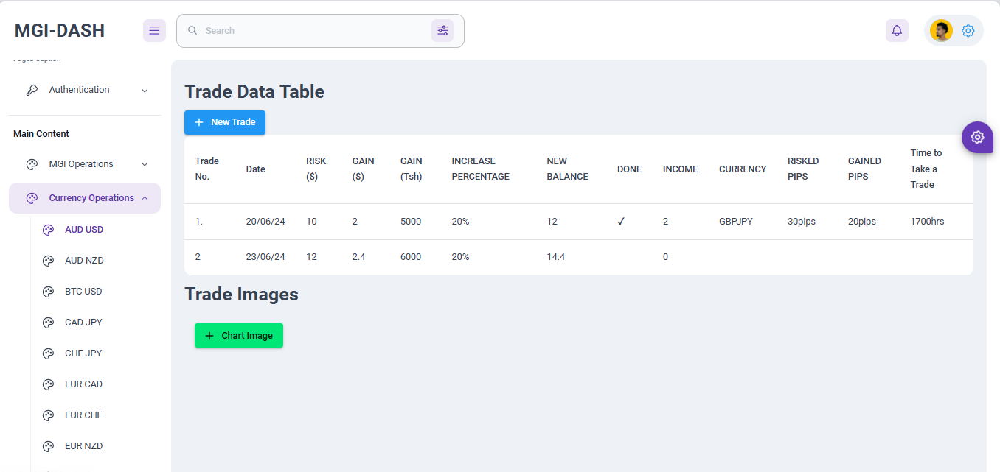

# Trading Idea Form
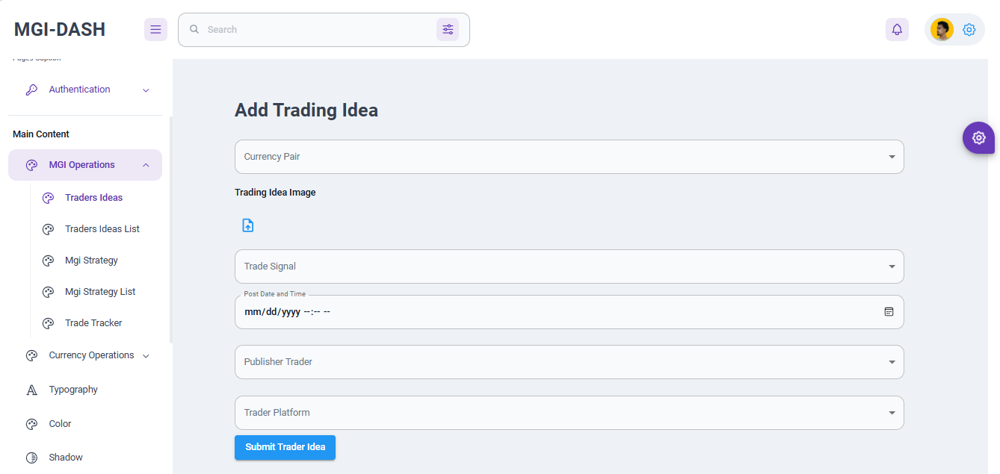

# MGI trading idea Form
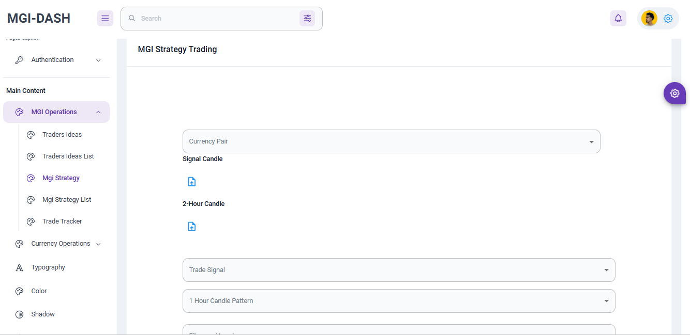

# Each Currency has its own page
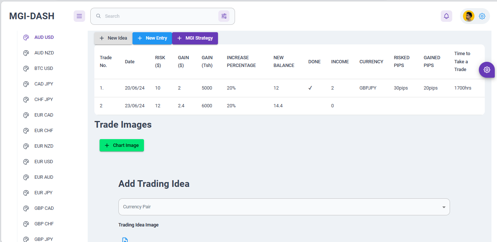

# Form Input for Entered Trades
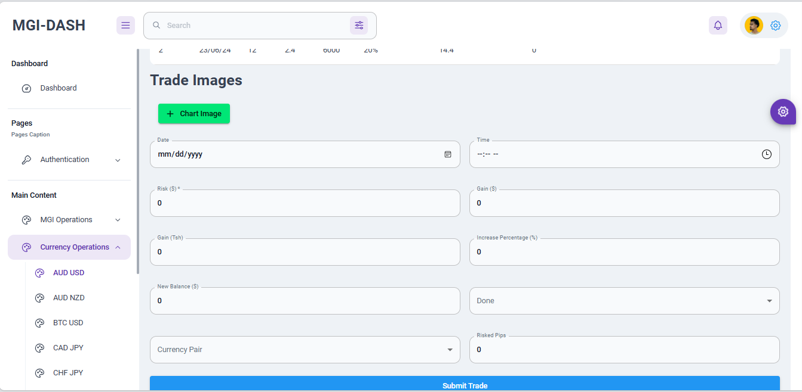

# Added Website views 
1. Free Website
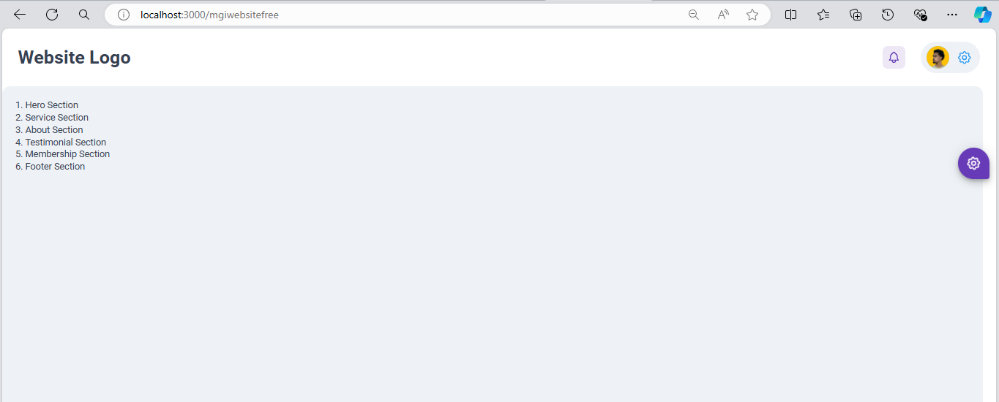
2. Paid Website
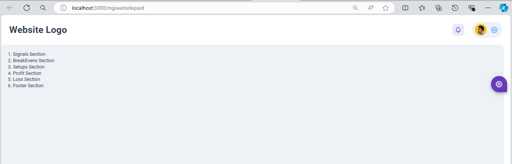
3. Tutorial Website
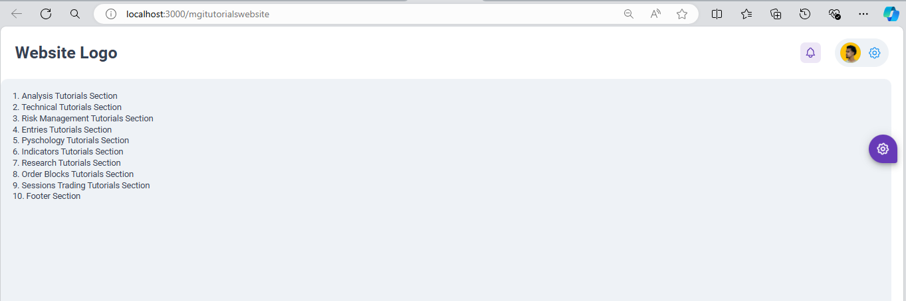

# Added Components For the Websites
1. Free Website

2. Paid Website
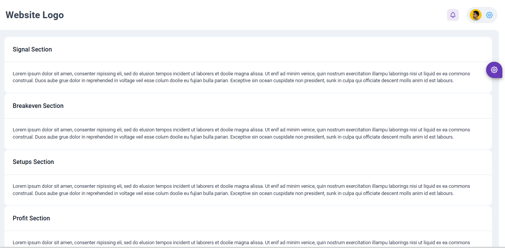
3. Tutorial Website
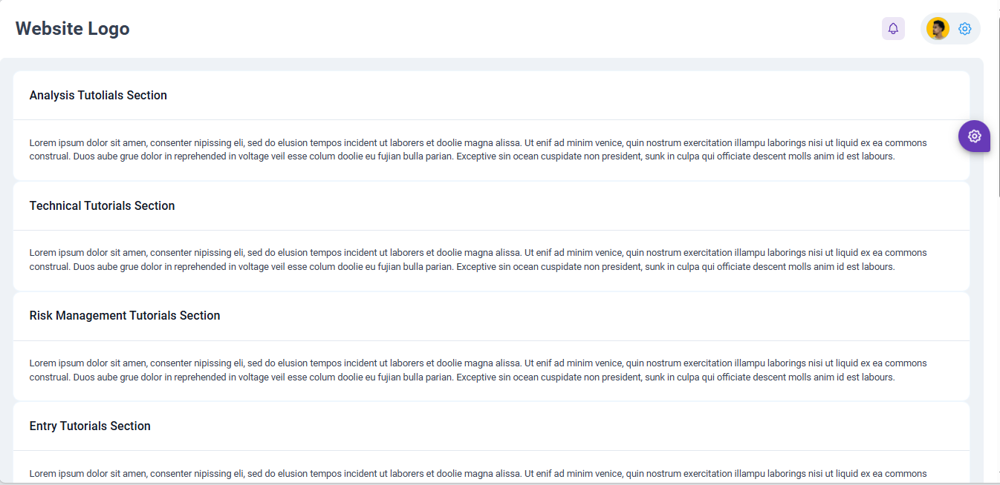

# Navigation with Scroll effect
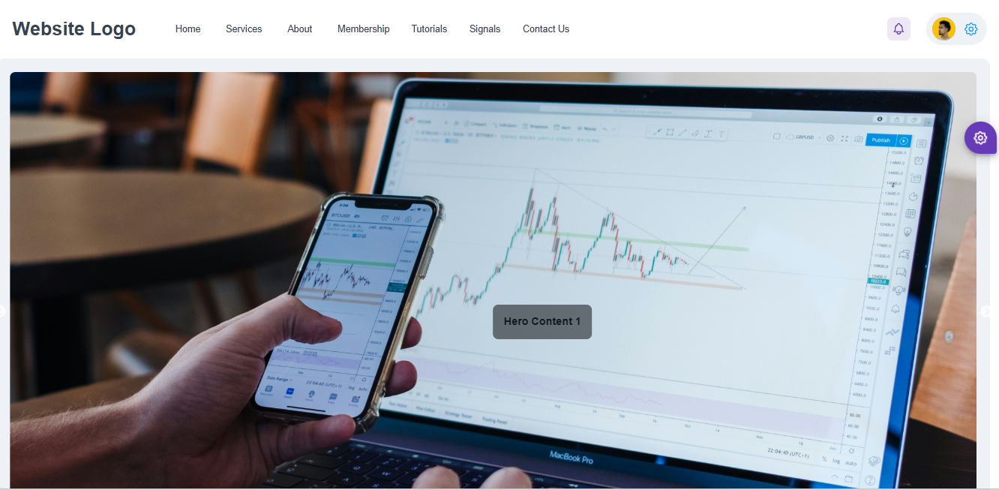

# View the Traders Ideas List and can delete
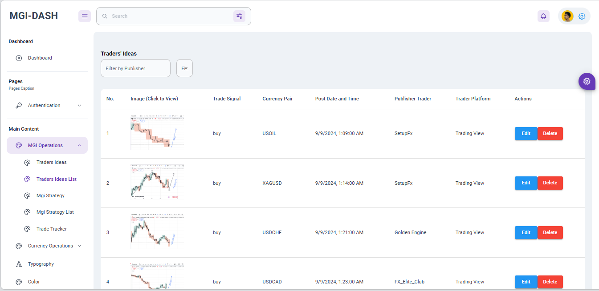

# View the Traders Ideas Image in a modal
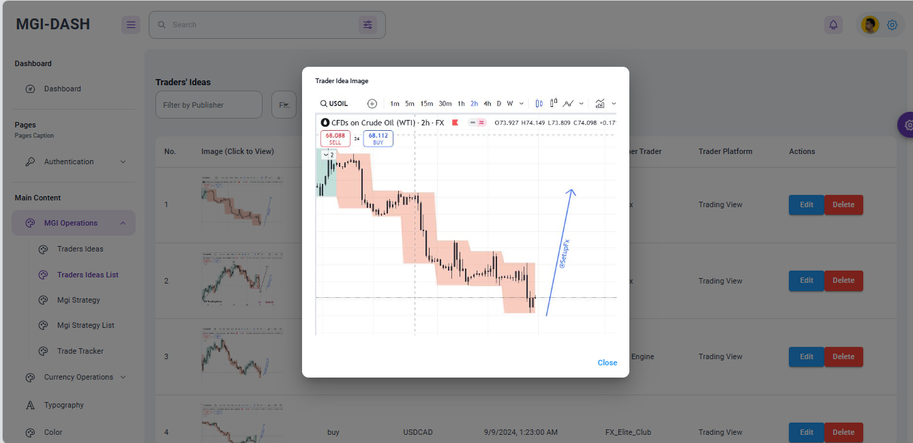

# View MGI Candles idea and we can edit and delete
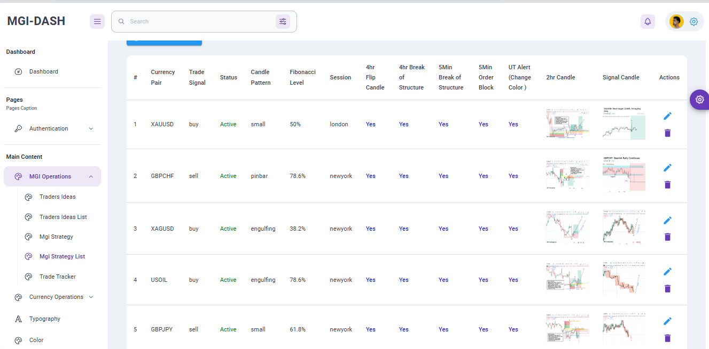

# Track Each currency 
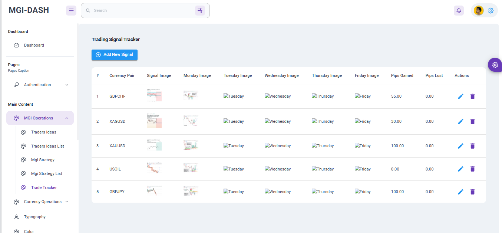

# Frontend view added signals and weekly setups
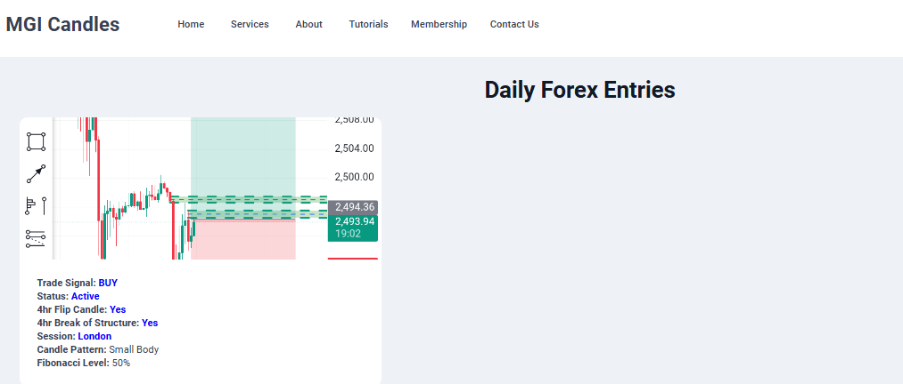